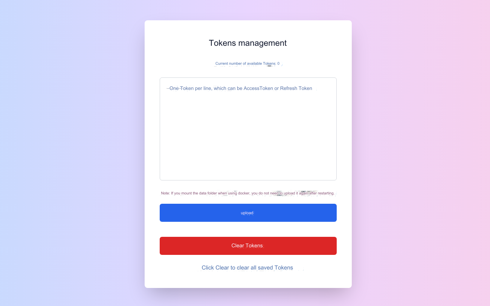

# CHAT2API

## Original Author: https://github.com/lanqian528/chat2api

🤖 A simple ChatGPT TO API proxy

🌟 Free, unlimited `GPT-3.5` available without an account

💥 Support AccessToken account, support `GPT-4`, `GPT-4o`, `GPTs`

🔍 The reply format is completely consistent with the real API and adapts to almost all clients.

## Function

> completed
> - [x] Streaming, non-streaming
> - [x] Login-free GPT3.5 conversation
> - [x] GPT-3.5 dialogue (the incoming model name does not contain gpt-4, then gpt-3.5 will be used by default, which is text-davinci-002-render-sha)
> - [x] GPT-4 dialogue (incoming model names include: gpt-4, gpt-4o, gpt-4-moblie to use the corresponding model, you need to pass in AccessToken)
> - [x] GPT-4 drawing, coding, networking
> - [x] Support GPTs (incoming model name: gpt-4-gizmo-g-*)
> - [x] Upload images and files (the format is API corresponding format, supports url and base64)
> - [x] WebUI (http://127.0.0.1:5005, does not support login)
> - [x] Can be used as a gateway and can be deployed on multiple machines
> - [x] Multi-account polling, supporting AccessToken and RefreshToken at the same time
> - [x] Tokens management, supports uploading and clearing

> TODO
> - [ ] None yet, welcome to submit an issue
> 

## Tokens management

First configure the environment variable `AUTHORIZATION`, and then run the program

Visit `/tokens` or `/api_prefix/tokens` to view the number of existing Tokens, upload new Tokens, or clear Tokens

When requesting, pass in the value you configured in `AUTHORIZATION` to poll multiple accounts. `AUTHORIZATION` can be configured with multiple values separated by commas.



## Environment variables

Each environment variable has a default value. If you do not understand the meaning of the environment variable, please do not set it, let alone pass an empty value.

```
# Security related
API_PREFIX=your_prefix // API prefix password. If not set, it is easy to be accessed. After setting, you need to request /your_prefix/v1/chat/completions
AUTHORIZATION=sk-xxxxxxxx,sk-yyyyyyyy // Go first /tokens Upload ac or rt, pass it in when requesting AUTHORIZATION Multiple accounts can be polled
# Request related
CHATGPT_BASE_URL=https://chatgpt.com // ChatGPT gateway address. After setting, the requested website will be changed. Multiple gateways are separated by commas.
PROXY_URL=your_first_proxy, your_second_proxy //Proxy URL, multiple proxies are separated by commas
ARKOSE_TOKEN_URL=https://arkose.example.com/token // Get the address of Arkose token, instructions are provided above
# Function related
HISTORY_DISABLED=true // Whether not to save the chat record and return conversation_id, true means not to save and not return
POW_DIFFICULTY=000032 // The difficulty of proof of work to be solved. The smaller the string, the longer the calculation time. It is recommended to 000032
RETRY_TIMES=3 //Number of retries on error
ENABLE_GATEWAY=true // Whether to enable gateway mode (WEBUI), true means enabled
CONVERSATION_ONLY=false // The gateway used supports being enabled when the server handles pow and arkose. If enabled, the conversation interface will be used directly.
```

## Deploy

### Deploy directly

```bash
git clone https://github.com/Niansuh/chat2api
cd chat2api
pip install -r requirements.txt
python app.py
```

### Docker deployment

You need to install Docker and Docker Compose.

```bash
docker run -d \
  --name chat2api \
  -p 5005:5005 \
  niansuh/chat2api:latest
```

### (Recommended, PLUS account available) Docker Compose deployment

Create a new directory, such as chat2api, and enter that directory:

```bash
mkdir chat2api
cd chat2api
```

Download the docker-compose.yml file in the library in this directory:

```bash
wget https://raw.githubusercontent.com/Niansuh/chat2api/main/docker-compose.yml
```

Modify the environment variables in the docker-compose.yml file and save:

```bash
docker-compose up -d
```

## Use

1. To use it on the web, directly access the following address, which only supports binding GPT3.5:

```
http://127.0.0.1:5005
```

2. Using API, supports passing AccessToken or RefreshToken, available GPT-4, GPT-4o, GPTs:

```bash
curl --location 'http://127.0.0.1:5005/v1/chat/completions' \
--header 'Content-Type: application/json' \
--header 'Authorization: Bearer {{OpenAI APIKEY}}' \
--data '{
     "model": "gpt-3.5-turbo",
     "messages": [{"role": "user", "content": "Say this is a test!"}],
     "stream": true
   }'
```
Pass in your account's `AccessToken` or `RefreshToken` as `OpenAI APIKEY`

If the `AUTHORIZATION` environment variable is set, the set value can be passed in as `OpenAI APIKEY` for multi-Tokens polling

> - Obtain `AccessToken`: After logging in to chatgpt official website, open https://chatgpt.com/api/auth/session to obtain the value of `accessToken`
> - `RefreshToken` acquisition: No acquisition method is provided here.
> - Login-free gpt3.5 No need to pass in Token


## ArkoseToken

> #### Currently supports external services providing ArkoseToken
>
> #### It is recommended to use docker-compose for deployment, which has built-in Arkose service

1. Set the environment variable ARKOSE_TOKEN_URL

2. When `ArkoseToken` is needed, `chat2api` will send a `POST` request to `ARKOSE_TOKEN_URL`

3. Please provide external services in the following format:

- Request body:

```request body
{"blob": "rFYaxQNEApDlx/Db.KyrE79pAAFBs70CYtbM4pMNUsc7jIkLGdiDs7vziHRGe78bqWXDo0AYyq2A10qIlcTt89lBYXJqCbONC/nD8C199pEZ/c9ocVKKtM27jZQ7fyOpWd9p5qjKeXT4xEGBFpoE3Re1DwdQeijYp7VMJQyw7RYN+IDB1QEx3aKSO6aTI+ivnhw9ztfn/p1SkvAyyOhur/ArF08WQ+rXQpxpttaSQlzMsIwlYbuUUuYE2f9JrQaYG7qip1DKvju111P6wTNy4QVlMXG32VrzaOWh4nmQ0lOcZ1DmN6u2aeJZotffHV2zOOQAqqnParidTbN+qFre2t77ZwBuGKGqLyT8LeOp02GdFwcyw0kkeX+L7vwYAzBpjA5ky0r0X+i8HpzWt8QCyWzEW9kHn9LLCTwg2MOumzjb66Ad4WDe+C1bAcOKuEyXiYh+a1cWZAOdzEuxEg90yCfI7DZR94BsoDR85gEC/Og88i098u5HV7hZZEOQ6J8fmi68FSyPkN7oLCmBsZCMAZqzapNP/MkeIMExrdw7Jf/PtMrZN4bwM56mWfyIJf5h/zXu8PUajVwE9Pj/M5VtB0spZg49JNeHExosVCAB0C0JW+T8vEIwoqiY4pRQ0lbMHTQZFpU2xURTgcgh+m6g1SEYR1FY3de1XnzfiTQq1RTNJPydj5xpt6r6okr8yIJdRhmVXlQI+pS7vi3+Lls2hnpr7L+l1mcUIMPZNBCs3AUFJNpp6SwQjZkPvKggg1p+uS6PdvKRizM9O9+FKc103AhuSia8KTrvU8tWhBhCzIHCD4LNfnkjuBWSdbDttva4AEXUoPuKkQCWaBzq4lQPUIHFOM9HmNe738vVkNdAuOYffxDNegcpIxLVgZGfbgLQ="}
```

- Response body:

```response body
{"token": "45017c7bb17115f36.7290869304|r=ap-southeast-1|meta=3|metabgclr=transparent|metaiconclr=%23757575|guitextcolor=%23000000|pk=0A1D34FC-659D-4E23-B17B-694DCFCF6A6C|at=40|sup=1|rid=3|ag=101|cdn_url=https%3A%2F%2Ftcr9i.openai.com%2Fcdn%2Ffc|lurl=https%3A%2F%2Faudio-ap-southeast-1.arkoselabs.com|surl=https%3A%2F%2Ftcr9i.openai.com|smurl=https%3A%2F%2Ftcr9i.openai.com%2Fcdn%2Ffc%2Fassets%2Fstyle-manager"}
```

## Common problem

> - Error code:
>   - `401`: The current IP does not support login-free, please try changing the IP address, or setting a proxy in the environment variable `PROXY_URL`, or your authentication fails.
>   - `403`: Please check the specific error information in the log
>   - `429`: The current IP request has exceeded the limit within 1 hour. Please try again later or change the IP.
>   - `500`: Server internal error, request failed.
>   - `502`: The server gateway is wrong, or the network is unavailable. Please try changing the network environment.

> - What is known:
>   - Many Japanese IPs do not support Bintang. It is recommended to use American IPs for Bintang 3.5.
>   - 99% of accounts support free `GPT-4o`, but it is opened according to the IP region. Currently, Japan and Singapore IP are known to have a higher probability of being opened.
> - What is the environment variable `AUTHORIZATION`?
>   - It is an authentication that you set for chat2api. After setting it, you can use the saved Tokens for polling. When requesting, it is passed in as `APIKEY`

> - How to obtain AccessToken?
>   - After logging in to the chatgpt official website, open https://chatgpt.com/api/auth/session to obtain the value of `accessToken`
> - PLUS account reports error `403`?
>   - PLUS account needs to configure `ArkoseToken`, please configure it according to the above
> - ArkoseToken What is it and how to get it?
>   - Please refer to the instructions above. For more information, please refer to https://www.arkoselabs.com/


## Sponsor

[](https://capsolver.com)


## License

MIT License
